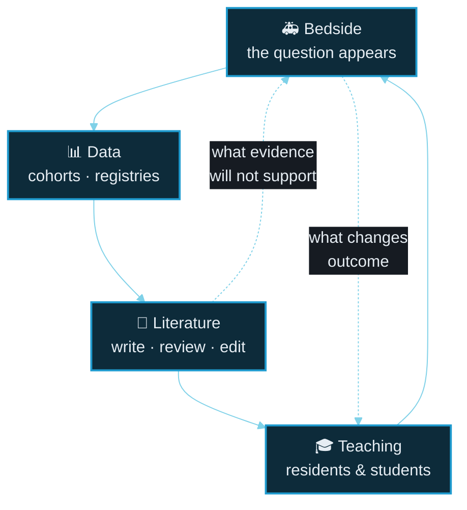

<div align="center">


# Faruk Danış, MD

**Emergency Physician · Academic · Medical Educator**

<a href="https://github.com/farukdanis">
  
</a>

<br/>

<a href="https://orcid.org/0000-0001-8722-5402"></a>
<a href="https://scholar.google.com/citations?user=4Z8joA0AAAAJ"></a>
<a href="https://www.scopus.com/authid/detail.uri?authorId=57447149900"></a>
<a href="https://www.webofscience.com/wos/author/record/J-7510-2015"></a>

<a href="https://www.faruk.md"></a>
<a href="https://www.linkedin.com/in/farukdanis/"></a>
<a href="https://x.com/farukdanis"></a>
<a href="https://www.instagram.com/farukdanis"></a>
<a href="mailto:farukdanis@gmail.com"></a>

</div>

---

## 🩺 About

I am an **emergency physician and faculty member** at Bolu Abant İzzet Baysal University Faculty of Medicine, working clinically at Bolu İzzet Baysal Training and Research Hospital.

My week runs on three tracks that keep feeding each other: **the resuscitation bay**, **the manuscript**, and **the classroom**. Emergency medicine is the only specialty where you have to be right before you are certain — everything below is an attempt to shorten that gap.

```yaml
role:      Assistant Professor of Emergency Medicine
clinical:  Airway · Resuscitation · Trauma · Critical Care · Point-of-Care Ultrasound
academic:  Editorial roles · Peer review · Thesis supervision · Undergraduate teaching
society:   Chair, Media & Communications Committee — EMAT (TATD)
interests: Decision rules · AI in medical publishing · Educational design
location:  Bolu, Türkiye 🇹🇷
```

---

## 🔬 Areas of Interest

<table>
<tr>
<td width="33%" valign="top">

### 🫁 Acute Care & Resuscitation
Airway management, trauma care, critical illness in the emergency department, and the decision rules that separate a defensible call from a lucky one.

</td>
<td width="33%" valign="top">

### 🤖 AI in Academic Medicine
Where large language models genuinely help medical writing, peer review and editorial work — and, just as importantly, where they quietly do harm.

</td>
<td width="33%" valign="top">

### 🎓 Medical Education
Flipped classrooms, simulation, assessment design and item writing for undergraduate and residency training in emergency medicine.

</td>
</tr>
</table>

---

## 📚 Academic Footprint

<div align="center">

| | |
|---|---|
| **Indexed works** | Peer-reviewed articles, book chapters and translations in emergency medicine |
| **Peer review** | 65+ completed reviews across 15 journals |
| **Editorial roles** | *Anatolian Journal of Emergency Medicine* · *Abant Medical Journal* |
| **Translation** | ATLS (Advanced Trauma Life Support) — Turkish edition contributor |
| **Society** | Chair, Media & Communications Committee — Emergency Medicine Association of Turkey (EMAT / TATD) |

</div>

> 📄 Full publication list, citation metrics and review record: **[ORCID](https://orcid.org/0000-0001-8722-5402)** · **[Google Scholar](https://scholar.google.com/citations?user=4Z8joA0AAAAJ)** · **[Scopus](https://www.scopus.com/authid/detail.uri?authorId=57447149900)** · **[DergiPark](https://dergipark.org.tr/en/pub/@farukdanis)**

---

## 🛠️ Toolbox

<div align="center">


</div>

---

## 🔁 How the Work Loops

Nothing here is a separate career. The question is born at the bedside, gets answered with data, is argued in the literature, and comes back as something a resident can use at 04:00 — then starts again.



<!--
  GitHub statistics cards — uncomment once public repositories are live:

  
  
-->

---

## 💬 Let's Talk

I am open to collaboration on **emergency medicine research**, **multicentre studies**, **AI applications in clinical care and medical publishing**, and **peer review** for journals in emergency and acute care medicine.

<div align="center">

**[🌐 faruk.md](https://www.faruk.md)** · **[✉️ farukdanis@gmail.com](mailto:farukdanis@gmail.com)** · **[💼 LinkedIn](https://www.linkedin.com/in/farukdanis/)** · **[𝕏 @farukdanis](https://x.com/farukdanis)**

<br/>

<i>"The patient in front of you does not care about your p-value — but the next thousand do."</i>


</div>
